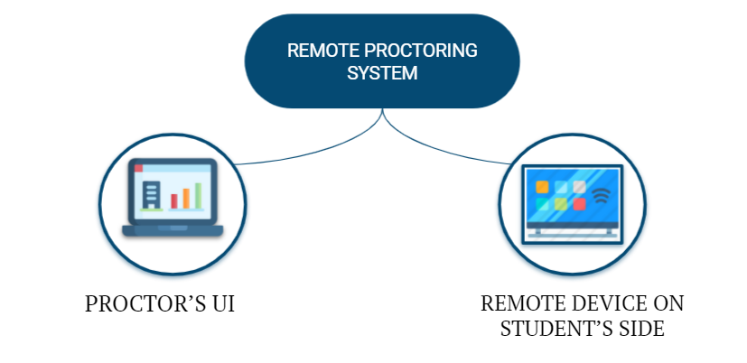
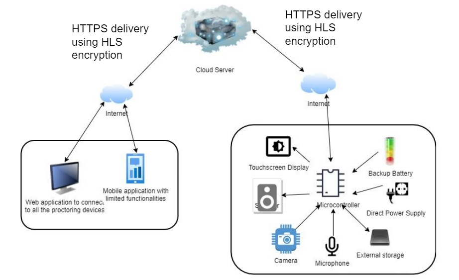

# REMOTE PROCTORING SYSTEM

---

## TEAM
-  E/17/058, DEVINDI G.A.I, [e17058@eng.pdn.ac.lk](mailto:name@email.com)
-  E/17/190, LIYANAGE S.N, [e17190@eng.pdn.ac.lk](mailto:name@email.com)
-  E/17/369, WANNIGAMA S.B, [e17369@eng.pdn.ac.lk](mailto:name@email.com)

[//]: # (## [Image of the final hardware]) 

## CONTENT
1. [PROBLEM STATEMENT](#problem-statement)
2. [SOLUTION](#solution )
3. [SYSTEM OVERVIEW](#system-overview)
4. [LINKS](#links)

---

## PROBLEM STATEMENT

When conducting examinations where the skills of the students in a limited timeframe, it's crucial to manage the external factors affecting the performance of the students at a satisfactory level. 
However it could be challenging to manage these factors in an online environment.

## SOLUTION
##### ***REMOTE PROCTORING DEVICE***
We have come up with a single device which integrates the hardware and software components needed to conduct an examination in the currently implemented system, which will provide a seamless process for the proctors and students involved in an examination.

[//]: # (## Solution Architecture High level diagram + description)

## BASIC FEATURES

#### ***STUDENT'S UI***

#### ***ADMINS'S UI***

#### ***PROCTOR'S UI***

#### ***REMOTE DEVICE***

## SYSTEM OVERVIEW

The device on the student's side is capable of capturing the video and audio stream from students continuously even incase of a power failure.
The proctor will be able to monitor the video and audio streams captured from all the students facing an examination through the browser application in the proctor's side.

##### ***HIGH-LEVEL SYSTEM OVERVIEW***

The system consists of three main endpoints.

* Web browser in Proctor's end
* Desktop application in Student's end
* Database and server application hosted on the Cloud
* Method used to ensure secure video/audio streaming:

HTTPS protects the user from so-called “man-in-the-middle” attacks where hackers can use vulnerabilities in these public networks to steal data as it’s being transmitted to the viewer. using HLS encryption to mask a users’ connection with the website and prevents this sort of attack.

#### ***TECHNOLOGY STACK***

## LINKS

- [Project Repository](https://github.com/cepdnaclk/e17-3yp-remote-proctoring-system){:target="_blank"}
- [Project Page](https://cepdnaclk.github.io/e17-3yp-remote-proctoring-system){:target="_blank"}
- [Department of Computer Engineering](http://www.ce.pdn.ac.lk/){:target="_blank"}
- [University of Peradeniya](https://eng.pdn.ac.lk/){:target="_blank"}

[//]: # (Please refer this to learn more about Markdown syntax)
[//]: # (https://github.com/adam-p/markdown-here/wiki/Markdown-Cheatsheet)
